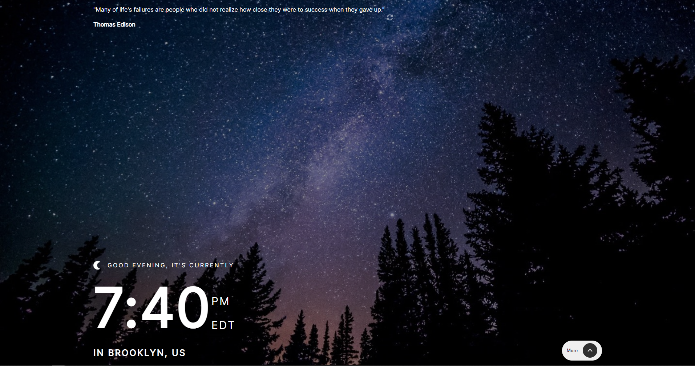

# My Time - React Clock with Quotes

## Overview

This React application displays the time, as well as other information such as timezone, city, and country using the following APIS:

- [World Time API](http://worldtimeapi.org/) to get information used in the expanded information such as the day of the year.
- [IP Geolocation API](https://freegeoip.app/) to get the city and country displayed underneath the time

- [Quotable API](https://api.quotable.io/random/) to get the random quotes displayed at the top of the application

Users should be able to:

- View the optimal layout for the site depending on their device's screen size
- See hover states for all interactive elements on the page
- View the current time and location
- View additional information about the date and time in the expanded state
- Be shown the correct greeting and background image based on the time of day they're visiting the site
- Generate quotes by clicking the refresh icon near the quote

### Screenshot

### Links

- Live Site URL: [https://myworldtime.netlify.app/](https://myworldtime.netlify.app)

### Built with

- [React](https://reactjs.org/) - JS library
- SCSS
- Flexbox
- Mobile-first workflow

## Author

- Website - [Aaron Buachie](https://abuachie.com)
